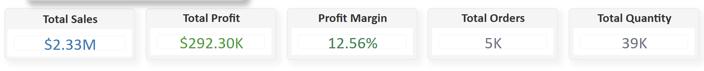

# business-performance-dashboard
Interactive Power BI dashboard analysing sales, profitability, product performance, business risks, and key operational drivers for executive decision-making.

## Executive Overview

### Overview
This page provides a high-level summary of overall business performance across sales, profitability, orders, and product activity. The goal of the dashboard is to help decision-makers quickly evaluate business health, monitor KPIs, and identify areas requiring attention.

## 📌 KPI Summary Cards

### Overview
This section provides an executive snapshot of the organisation’s overall business performance across sales, profitability, customer activity, and product movement.

The purpose of these KPI cards is to allow stakeholders quickly assess business health at a glance without needing to analyse detailed reports.

### KPI Breakdown

- **Total Sales ($2.33M):**
Represents the total revenue generated during the reporting period, indicating strong overall business activity and customer demand.

- **Total Profit ($292.30K):**
Shows the organisation’s net profitability after accounting for associated business costs.

- **Profit Margin (12.56%):**
Measures how efficiently the business converts revenue into actual profit. The margin suggests the business is profitable, although there may still be opportunities to improve operational efficiency and cost management.

- **Total Orders (5K):**
Represents the total number of customer transactions processed during the reporting period.

- **Total Quantity (39K):**
Tracks the total number of units sold, providing visibility into product movement and sales volume.

### Business Insight
While the business demonstrates strong sales performance, the profit margin indicates that profitability is growing at a slower rate compared to revenue. This may suggest higher operational costs, discounting strategies, or lower-margin products affecting overall profitability.

### Why This Visual Was Used
KPI cards were selected because they provide immediate visibility into critical business metrics and support fast executive-level decision-making.

## 📈 Business Performance Trend

### Overview
This visual analyses sales and profit performance over time to identify growth patterns, fluctuations, seasonality, and overall business momentum.

The chart compares total sales against total profit across the reporting timeline, allowing stakeholders evaluate whether revenue growth is translating into profitability.

### Key Observations

- The business demonstrates an overall upward sales trend over time, with sales peaking at approximately $118K towards the later reporting periods.

- Profit growth remains positive but significantly lower relative to sales, suggesting that increased revenue does not always result in proportional profitability.

- Several periods show sharp fluctuations in sales performance, which may indicate:
  - seasonal demand changes,
  - promotional campaigns,
  - operational instability,
  - or varying customer purchasing behaviour.

- Certain periods also show reduced profitability despite healthy sales performance, which could point to:
  - increased operational costs,
  - higher discounts,
  - shipping expenses,
  - or low-margin product categories.

### Business Insight
The business is experiencing consistent revenue growth; however, profitability stability remains a key area for improvement. This insight can help stakeholders investigate cost drivers, optimise pricing strategies, and focus on higher-margin products.

### Why This Visual Was Used
A line chart was chosen because it effectively visualises performance trends over time and helps stakeholders quickly identify growth patterns, fluctuations, and business performance changes.
