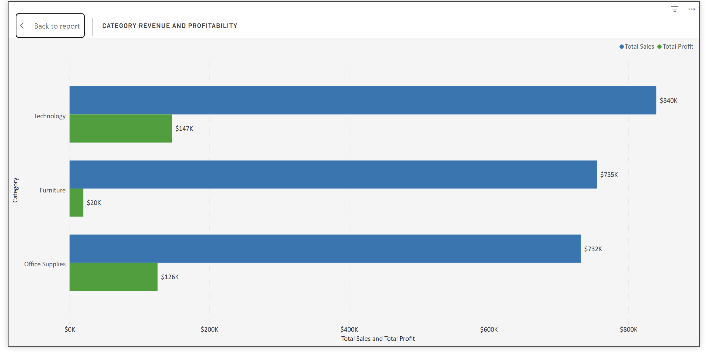
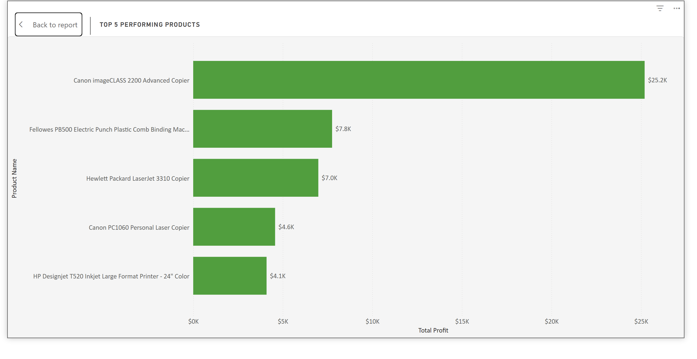
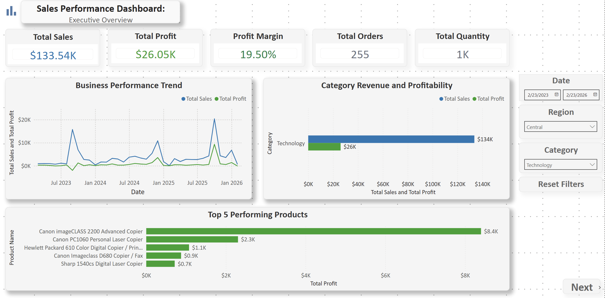

# 📊 Business Performance Dashboard — Power BI

## 📌 Project Objective

The goal of this project was to design an interactive Power BI dashboard capable of transforming raw business data into actionable insights for executive decision-making.

The dashboard was built to analyse overall business performance through:
- sales and profitability tracking,
- product performance evaluation,
- business trend analysis,
- risk identification,
- and business driver analysis.

Rather than simply presenting charts, the objective was to create a Business Intelligence solution that makes complex business data easier to understand, explore, and act upon — helping stakeholders monitor KPIs, identify performance gaps, and support data-driven strategic decisions.

---

## 📋 Executive Overview

### Overview
This page was designed to provide a high-level summary of overall business performance across sales, profitability, order activity, and product movement.

The goal is to help stakeholders quickly understand how the business is performing without needing to go through raw transactional data.

The dashboard combines:
- KPI monitoring,
- trend analysis,
- category profitability comparison,
- product performance analysis,
- and interactive filtering

to support faster and more informed business decision-making.

---

## 📌 KPI Summary

| KPI | Value | What It Represents |
|---|---|---|
| **Total Sales** | $2.33M | Total revenue generated across all products, categories, and regions |
| **Total Profit** | $292.30K | Actual profit retained after operational and product-related costs |
| **Profit Margin** | 12.56% | Profit retained from every dollar of sales *(Total Profit ÷ Total Sales × 100)* |
| **Total Orders** | 5K | Total number of customer orders processed during the reporting period |
| **Total Quantity** | 39K | Total units sold across all product categories |

### Business Insight
The business generated **$2.33M** in total sales with strong order and product volume, indicating healthy market activity across the reporting period.

However, a **12.56% profit margin** against $2.33M in revenue suggests that while the business is profitable, there are still opportunities for:
- cost optimisation,
- pricing improvements,
- and operational efficiency enhancements.

Tracking profit alongside revenue helps stakeholders evaluate business sustainability rather than focusing on revenue growth alone.

---

## 📈 Business Performance Trend Analysis

### Purpose
This line chart tracks sales and profit performance over time to identify:
- growth trends,
- business fluctuations,
- seasonal movement,
- and operational performance patterns.

### Key Findings
The business demonstrates fluctuating but generally upward sales growth over the reporting period, with several strong sales spikes visible towards late 2025 and 2026.

Profit trends generally follow sales movement; however, profitability growth remains smaller relative to sales increases.

### Business Insight
Although revenue is increasing, profitability is not growing at the same pace.

This may indicate:
- rising operational costs,
- discount-heavy sales strategies,
- or low-margin product sales driving volume without proportional profit returns.

### Why This Visual Was Chosen
Line charts are highly effective for time-series analysis because they clearly display trends, fluctuations, peaks, and long-term business performance movement.

---

## 📊 Category Revenue & Profitability Analysis

### Purpose
This visual compares category-level revenue against actual profitability to evaluate category performance efficiency.

### Key Findings

| Category | Total Sales | Total Profit | Observation |
|---|---|---|---|
| **Technology** | ~$840K | ~$147K | Highest revenue and strongest profitability |
| **Furniture** | ~$755K | ~$20K | Strong revenue but weak profitability |
| **Office Supplies** | ~$732K | ~$126K | Stable revenue with strong profit efficiency |

### Business Insight
Technology is the strongest-performing category overall, demonstrating both strong revenue generation and healthy profitability.

Furniture, despite generating strong sales, produced significantly lower profit — suggesting:
- high operational costs,
- discount pressure,
- or inefficient pricing structures.

Office Supplies demonstrates stronger profit efficiency relative to its revenue, making it a more sustainable category from a profitability standpoint.

### Why This Visual Was Chosen
A clustered bar chart allows stakeholders to directly compare revenue and profitability side-by-side across business categories, making performance gaps immediately visible.

---

## 🏆 Top 5 Performing Products Analysis

### Purpose
This visual identifies the products contributing the highest profit to the business.

### Key Findings
The **Canon imageCLASS 2200 Advanced Copier** significantly outperformed all other products, generating approximately **$25.2K** in profit.

The remaining top-performing products contributed considerably smaller profit values by comparison.

### Business Insight
The business appears to rely heavily on a small number of high-performing products, creating potential concentration risk if demand patterns shift.

This analysis highlights opportunities to:
- prioritise high-margin products,
- strengthen marketing strategies around top-performing products,
- and investigate why other products underperform comparatively.

### Why This Visual Was Chosen
Horizontal bar charts are highly effective for ranked product comparisons because they improve readability while accommodating longer product names.

---

## 🎛️ Interactive Slicers & Filtering

The dashboard includes interactive slicers for:
- **Date filtering** — analyse performance across custom time periods
- **Region analysis** — isolate and compare regional business performance
- **Category drill-downs** — explore category-level trends in detail

These slicers allow users to dynamically explore business performance and conduct scenario-based analysis across different segments of the business.

---

## 📌 Scenario-Based Analysis — Filtered Dashboard View

### Purpose
This filtered dashboard view demonstrates the interactivity of the dashboard by showing how business performance changes when specific filters are applied.

#### Filters Applied
- Date Range = February 23, 2023 — February 23, 2026
- Region = Central
- Category = Technology

### Key Findings

| KPI | Overall Business | Central — Technology | Change |
|---|---|---|---|
| **Total Sales** | $2.33M | $133.54K | Filtered segment |
| **Total Profit** | $292.30K | $26.05K | Filtered segment |
| **Profit Margin** | 12.56% | 19.50% | ▲ +6.94pp |
| **Total Orders** | 5K | 255 | Filtered segment |
| **Total Quantity** | 39K | 1K | Filtered segment |

### Business Insight
Although the filtered sales value is lower than the overall business total, the profit margin increased significantly from **12.56%** to **19.50%**.

This suggests that the Technology category within the Central region operates more efficiently and generates stronger profitability relative to the overall business average.

The filtered analysis also reveals that a smaller operational segment can still produce healthy margins, highlighting the importance of drill-down analysis in identifying profitable business areas.

### Trend Observation
The filtered business trend indicates fluctuating sales activity over time, with several strong spikes in revenue generation.

Profit trends generally follow sales movement, confirming a positive relationship between revenue growth and profitability within the selected segment.

### Product-Level Insight
Within the filtered Technology category, the **Canon imageCLASS 2200 Advanced Copier** remained the strongest-performing product, generating the highest profit contribution among the selected products.

This suggests that certain high-performing products continue to drive profitability even within narrowed business segments.

### Why This Matters
This scenario analysis demonstrates the dashboard's ability to support:
- interactive filtering,
- drill-down analysis,
- targeted business investigations,
- and dynamic decision-making.

It also validates that all slicers dynamically affect visuals across the full dashboard.

---

## 🚀 Skills Demonstrated

- Data Cleaning & Transformation
- Data Modelling
- DAX Calculations
- KPI Reporting
- Interactive Dashboard Design
- Business Performance Analysis
- Data Storytelling
- Scenario-Based Analysis
- Executive Reporting

---

## 🛠️ Tools Used

- Power BI
- Power Query
- DAX

---

> *"The goal is not to have more data. The goal is to have better decisions."*
