# 📊 Business Performance Dashboard — Power BI

## 📌 Project Objective

This Business Performance Dashboard was developed to transform transactional sales data into actionable business insights that support strategic decision-making.

The dashboard enables stakeholders to monitor overall business performance, evaluate product profitability, identify operational risks, and uncover the key drivers influencing revenue and profit growth.

Through interactive reporting, KPI monitoring, profitability analysis, trend evaluation, and scenario-based exploration, the solution provides a comprehensive view of business performance across products, categories, customer segments, and regions.

### Key Focus Areas
- Executive Performance Monitoring
- Product & Profitability Analysis
- Risk Identification & Assessment
- Business Driver Analysis
- KPI Reporting
- Interactive Filtering & Scenario Analysis
- Data Storytelling & Decision Support

---

## 📌 Executive Summary

Analysis of $2.33M in sales revealed that profitability challenges are driven less by revenue generation and more by discounting behaviour, product mix, and subcategory performance.

Key findings include:
- Technology is the strongest-performing category, generating approximately $147K in profit.
- Furniture generates strong revenue but suffers from significant margin pressure.
- Tables is the largest loss-making subcategory, producing a loss of $17.8K despite $208K in sales.
- High discount levels are strongly associated with loss-making transactions.
- Corporate Technology customers in the West region represent one of the most profitable growth opportunities identified.

The dashboard enables stakeholders to monitor business performance, identify profitability risks, and understand the key drivers influencing sales and profit outcomes.


## 💼 Business Impact

This dashboard helps decision-makers:
- Identify loss-making products and subcategories
- Monitor discount-related profitability risks
- Evaluate category and regional performance
- Discover high-margin growth opportunities
- Support data-driven pricing and product strategy decisions

---

## 🛠️ Tools & Technologies

- Power BI
- Power Query
- DAX

---

## 📂 Dataset Overview

The dataset contains transactional sales records including:

- Orders
- Products
- Categories & Subcategories
- Customer Segments
- Regions
- Sales, Profit & Quantity
- Order Dates

The data was transformed and analysed to uncover trends, profitability patterns, performance drivers, and business risks.

---

## 📸 Dashboard Preview

| Executive Overview | Product Analysis |
|---|---|
|[!Executive-Overview](../screenshots/executive-overview/executive-overview.png)| [!Product Analysis](../screenshots/product-analysis/product-analysis-overview.png) |

| Risk Analysis | Business Drivers |
|---|---|
| [!Risk Analysis](../screenshots/risk-analysis/risk-analysis-overview.png) | [!Business Drivers](../screenshots/business-drivers/business-drivers-overview.png) |

---

# 📈 Executive Overview

## 📋 Dashboard View

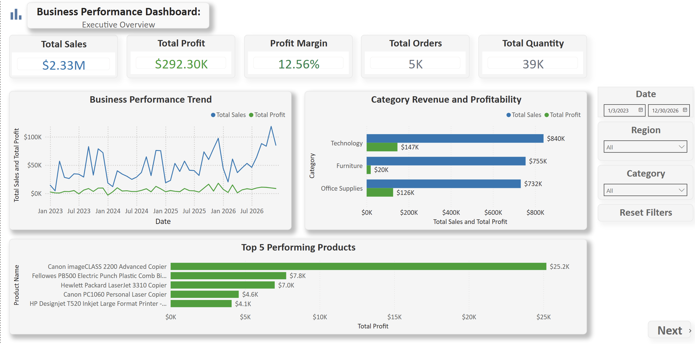

### Overview
This page was designed to provide a high-level summary of overall business performance across sales, profitability, order activity, and product movement.

The goal is to help stakeholders quickly understand how the business is performing without needing to go through raw transactional data.

The dashboard combines KPI monitoring, trend analysis, category-level profitability comparison, product performance analysis, and interactive filtering to support executive decision-making.

---

## 📌 KPI Summary

| KPI | Value | What It Represents |
|---|---|---|
| **Total Sales** | $2.33M | Total revenue generated across all products, categories, and regions |
| **Total Profit** | $292.30K | Actual profit retained after operational and product-related costs |
| **Profit Margin** | 12.56% | Profit retained from every dollar of sales *(Total Profit ÷ Total Sales × 100)* |
| **Total Orders** | 5K | Total number of customer orders processed during the reporting period |
| **Total Quantity** | 39K | Total units sold across all product categories |

### Business Insight
The business generated **$2.33M** in total sales with strong order and product volume, indicating healthy market activity across the reporting period.

However, a **12.56% profit margin** against $2.33M in revenue suggests that while the business is profitable, there are still opportunities for:
- cost optimisation,
- pricing improvements,
- and operational efficiency enhancements.

Tracking profit alongside revenue helps stakeholders evaluate business sustainability rather than focusing on revenue growth alone.

---

## 📈 Business Performance Trend Analysis

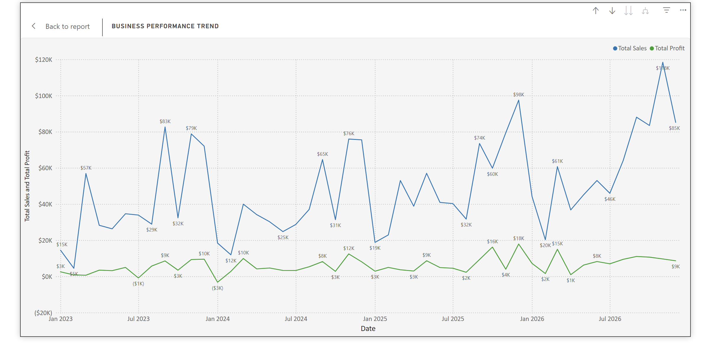

### Purpose
This line chart tracks sales and profit performance over time to identify:
- growth trends,
- business fluctuations,
- seasonal movement,
- and operational performance patterns.

### Key Findings
The business demonstrates fluctuating but generally upward sales growth over the reporting period, with several strong sales spikes visible towards late 2025 and 2026.

Profit trends generally follow sales movement; however, profitability growth remains smaller relative to sales increases.

### Business Insight
Although revenue is increasing, profitability is not growing at the same pace.

This may indicate:
- rising operational costs,
- discount-heavy sales strategies,
- or low-margin product sales driving volume without proportional profit returns.

### Why This Visual Was Chosen
Line charts are highly effective for time-series analysis because they clearly display trends, fluctuations, peaks, and long-term business performance movement.

---

## 📊 Category Revenue & Profitability Analysis


### Purpose
This visual compares category-level revenue against actual profitability to evaluate category performance efficiency.

### Key Findings

| Category | Total Sales | Total Profit | Observation |
|---|---|---|---|
| **Technology** | ~$840K | ~$147K | Highest revenue and strongest profitability |
| **Furniture** | ~$755K | ~$20K | Strong revenue but weak profitability |
| **Office Supplies** | ~$732K | ~$126K | Stable revenue with strong profit efficiency |

### Business Insight
Technology is the strongest-performing category overall, demonstrating both strong revenue generation and healthy profitability.

Furniture, despite generating strong sales, produced significantly lower profit — suggesting:
- high operational costs,
- discount pressure,
- or inefficient pricing structures.

Office Supplies demonstrates stronger profit efficiency relative to its revenue, making it a more sustainable category from a profitability standpoint.

### Why This Visual Was Chosen
A clustered bar chart allows stakeholders to directly compare revenue and profitability side-by-side across business categories, making performance gaps immediately visible.

---

## 🏆 Top 5 Performing Products Analysis


### Purpose
This visual identifies the products contributing the highest profit to the business.

### Key Findings
The **Canon imageCLASS 2200 Advanced Copier** significantly outperformed all other products, generating approximately **$25.2K** in profit.

The remaining top-performing products contributed considerably smaller profit values by comparison.

### Business Insight
The business appears to rely heavily on a small number of high-performing products, creating potential concentration risk if demand patterns shift.

This analysis highlights opportunities to:
- prioritise high-margin products,
- strengthen marketing strategies around top-performing products,
- and investigate why other products underperform comparatively.

### Why This Visual Was Chosen
Horizontal bar charts are highly effective for ranked product comparisons because they improve readability while accommodating longer product names.

---

## 🎛️ Interactive Slicers & Filtering

The dashboard includes interactive slicers for:
- **Date filtering** — analyse performance across custom time periods
- **Region analysis** — isolate and compare regional business performance
- **Category drill-downs** — explore category-level trends in detail

These slicers allow users to dynamically explore business performance and conduct scenario-based analysis across different segments of the business.

---

## 📌 Scenario-Based Analysis — Filtered Dashboard View

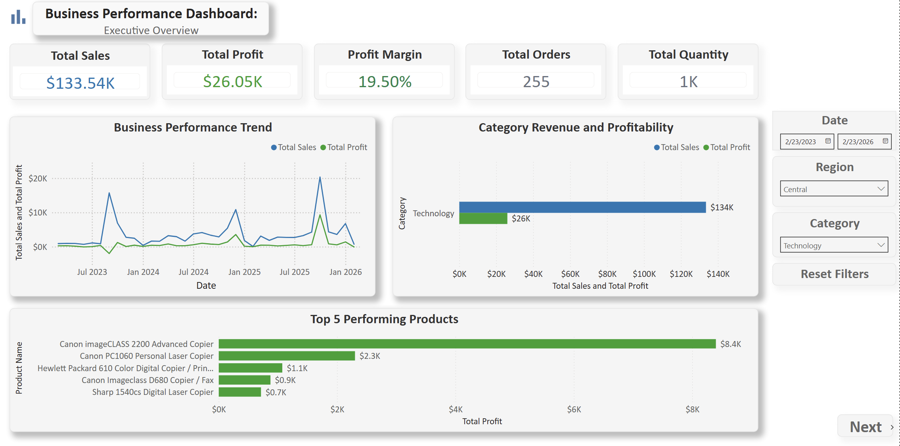

### Purpose
This filtered dashboard view demonstrates the interactivity of the dashboard by showing how business performance changes when specific filters are applied.

#### Filters Applied
- Date Range = February 23, 2023 — February 23, 2026
- Region = Central
- Category = Technology

### Key Findings

| KPI | Overall Business | Central — Technology | Change |
|---|---|---|---|
| **Total Sales** | $2.33M | $133.54K | Filtered segment |
| **Total Profit** | $292.30K | $26.05K | Filtered segment |
| **Profit Margin** | 12.56% | 19.50% | ▲ +6.94pp |
| **Total Orders** | 5K | 255 | Filtered segment |
| **Total Quantity** | 39K | 1K | Filtered segment |

### Business Insight
Although the filtered sales value is lower than the overall business total, the profit margin increased significantly from **12.56%** to **19.50%**.

This suggests that the Technology category within the Central region operates more efficiently and generates stronger profitability relative to the overall business average.

The filtered analysis also reveals that a smaller operational segment can still produce healthy margins, highlighting the importance of drill-down analysis in identifying profitable business areas.

### Trend Observation
The filtered business trend indicates fluctuating sales activity over time, with several strong spikes in revenue generation.

Profit trends generally follow sales movement, confirming a positive relationship between revenue growth and profitability within the selected segment.

### Product-Level Insight
Within the filtered Technology category, the **Canon imageCLASS 2200 Advanced Copier** remained the strongest-performing product, generating the highest profit contribution among the selected products.

This suggests that certain high-performing products continue to drive profitability even within narrowed business segments.

### Why This Matters
This scenario analysis demonstrates the dashboard's ability to support:
- interactive filtering,
- drill-down analysis,
- targeted business investigations,
- and dynamic decision-making.

It also validates that all slicers dynamically affect visuals across the full dashboard.

---

# 📦 Product Analysis

## 📋 Dashboard View

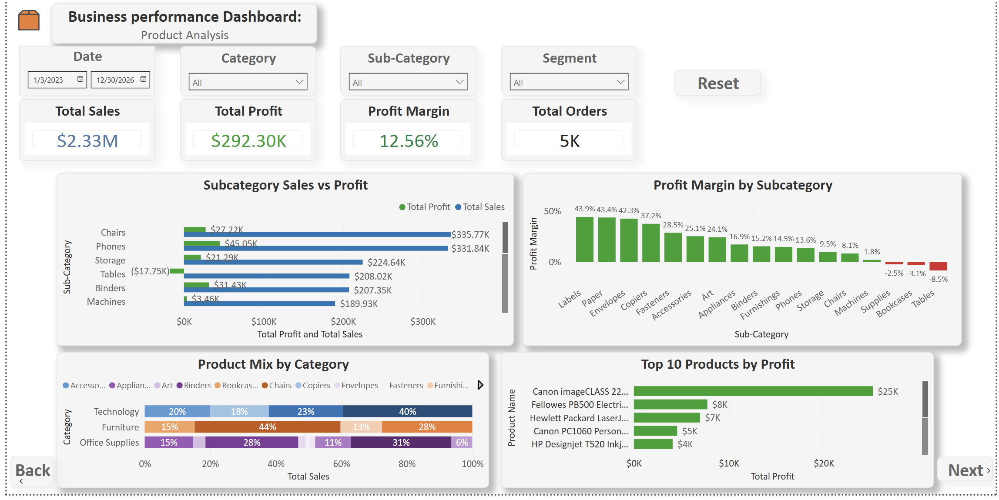

### Overview
While the Executive Overview focuses on overall business performance, the Product Analysis page examines performance at the product and subcategory level.

The objective is to identify which products and subcategories drive profitability, which ones underperform, and how product mix influences overall business results.

This page combines subcategory sales vs profit analysis, profit margin assessment by subcategory, product mix distribution, top-performing product identification, and scenario-based exploration to support product strategy and profitability optimisation.

---

## 📌 KPI Summary

| KPI | Value | What It Represents |
|---|---|---|
| **Total Sales** | $2.33M | Total revenue generated across all products, categories, and regions |
| **Total Profit** | $292.30K | Actual profit retained after operational and product-related costs |
| **Profit Margin** | 12.56% | Profit retained from every dollar of sales *(Total Profit ÷ Total Sales × 100)* |
| **Total Orders** | 5K | Total number of customer orders processed during the reporting period |

### Business Insight
These KPIs provide the baseline performance context established in the Executive Overview and serve as the benchmark for evaluating product-level profitability throughout this page.

---

## 📊 Subcategory Sales vs Profit Analysis

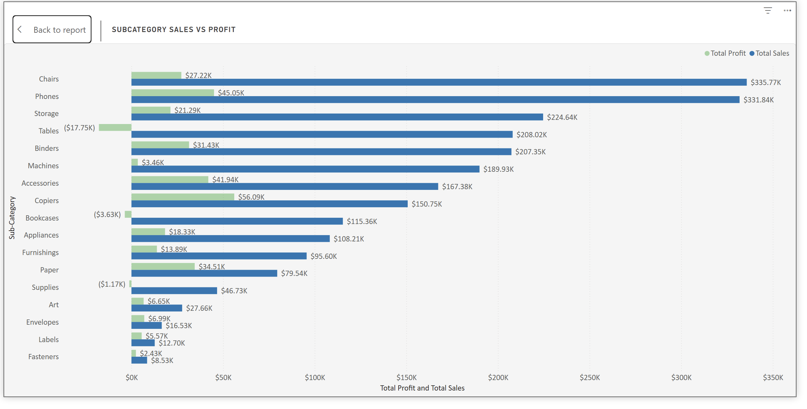

### Purpose
This visual compares total sales against total profit at the subcategory level, making it easy to identify which subcategories generate strong revenue but weak profitability — and which ones are operating at a loss.

### Key Findings

#### 🟢 Strong Performers

| Subcategory | Total Sales | Total Profit | Observation |
|---|---|---|---|
| **Copiers** | $150.75K | $56.09K | Highest profit efficiency relative to sales |
| **Phones** | $331.84K | $45.05K | High revenue with healthy profit contribution |
| **Accessories** | $167.38K | $41.94K | Strong profit relative to sales volume |
| **Binders** | $207.35K | $31.43K | Consistent profit generation |

#### 🔴 Problem Areas

| Subcategory | Total Sales | Total Profit | Observation |
|---|---|---|---|
| **Tables** | $208.02K | -$17.75K | Generating a loss despite strong sales volume |
| **Bookcases** | $115.36K | -$3.63K | Loss-making subcategory |
| **Supplies** | $46.73K | -$1.17K | Low volume but still operating at a loss |
| **Machines** | $189.93K | $3.46K | Very weak profit despite high sales |

### Business Insight
The most important finding in this visual is that **Tables is actively losing money** — generating $208K in sales but producing a net loss of $17.75K. This means every Table sale is costing the business more than it earns.

Combined with Bookcases and Supplies also operating at a loss, the Furniture category is carrying significant profitability risk beneath its strong headline sales numbers.

Copiers stand out as the most efficient subcategory — generating $56K in profit from $150K in sales, a margin efficiency that significantly outperforms most other subcategories.

### Why This Visual Was Chosen
A clustered horizontal bar chart allows direct side-by-side comparison of sales and profit per subcategory, making profitability gaps and losses immediately visible without requiring calculation.

---

## 📉 Profit Margin by Subcategory

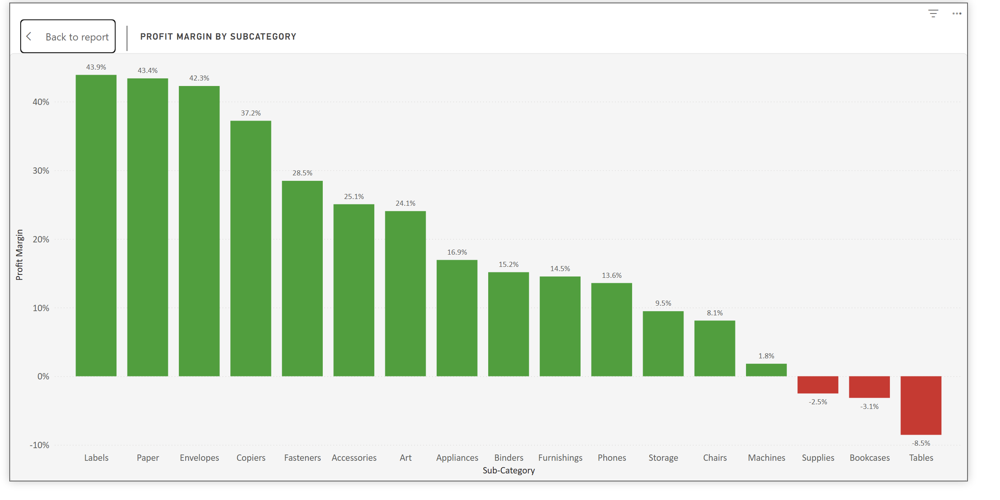

### Purpose
This visual ranks all subcategories by profit margin percentage, using colour coding to instantly separate profitable subcategories (green) from loss-making ones (red).

### Key Findings

#### Highest Margin Subcategories

| Subcategory | Profit Margin | Observation |
|---|---|---|
| **Labels** | 43.9% | Highest margin in the entire business |
| **Paper** | 43.4% | Near-identical to Labels — extremely efficient |
| **Envelopes** | 42.3% | Consistently strong margin |
| **Copiers** | 37.2% | Strong margin despite higher price point products |

#### Loss-Making Subcategories

| Subcategory | Profit Margin | Observation |
|---|---|---|
| **Tables** | -8.5% | Largest loss-making subcategory |
| **Bookcases** | -3.1% | Negative margin across the reporting period |
| **Supplies** | -2.5% | Small volume but still loss-making |

### Business Insight
The margin chart reveals a striking contrast within the business. Labels, Paper, and Envelopes — relatively low-cost, high-volume Office Supplies subcategories — are operating at margins above 40%, making them among the most profitable products in the portfolio despite their modest price points.

Tables, by contrast, is the most damaging subcategory at -8.5% margin. The business is effectively subsidising Table sales. Stakeholders should investigate whether this is driven by excessive discounting, high shipping costs, or supplier pricing issues — and consider whether the Tables subcategory warrants a pricing strategy review.

### Why This Visual Was Chosen
A ranked bar chart with conditional colour coding (green for profit, red for loss) allows stakeholders to immediately identify margin leaders and problem areas without needing to read individual values.

---

## 🧩 Product Mix by Category

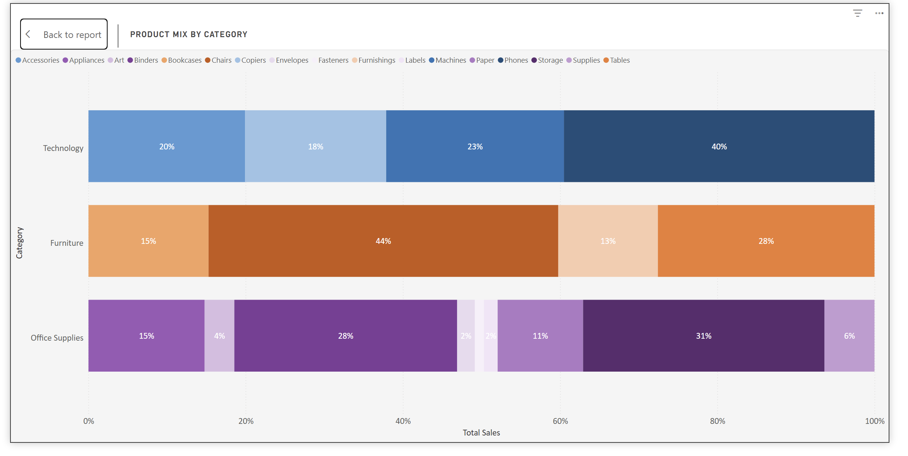

### Purpose
This visual shows how sales are distributed across subcategories within each category, revealing which subcategories dominate category revenue and where concentration risk may exist.

### Key Findings

| Category | Dominant Subcategory | Share | Observation |
|---|---|---|---|
| **Technology** | Storage | 40% | Single subcategory drives nearly half of Technology sales |
| **Technology** | Accessories | 20% | Second largest contributor |
| **Furniture** | Chairs | 44% | Chairs dominate Furniture sales |
| **Furniture** | Tables | 25% | Significant share despite being loss-making |
| **Office Supplies** | Paper | 31% | Largest Office Supplies contributor |
| **Office Supplies** | Binders | 28% | Strong second contributor |
| **Office Supplies** | Supplies | 1.17% | Minimal contribution and loss-making |

### Business Insight
The most concerning finding in this visual is that **Tables accounts for 25% of Furniture sales despite operating at a -8.5% profit margin**. This means a significant portion of Furniture revenue is coming from a subcategory that actively loses money — which directly explains why the Furniture category struggles with profitability despite strong headline sales.

Within Technology, the heavy concentration in Storage (40%) suggests potential dependency risk. If demand for Storage products declines, Technology revenue could be disproportionately affected.

Office Supplies shows the most balanced and healthy distribution, with multiple subcategories contributing meaningfully — reducing dependency on any single product line.

### Why This Visual Was Chosen
A 100% stacked bar chart is ideal for showing proportional contribution within categories, making subcategory dominance and concentration immediately visible across all three categories in a single view.

---

## 🏆 Top 10 Products by Profit

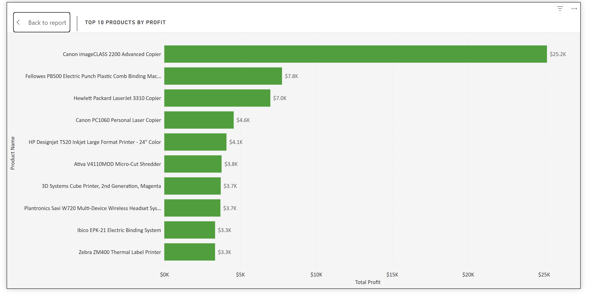

### Purpose
This visual identifies the ten individual products generating the highest profit contribution to the business.

### Key Findings

| Rank | Product | Total Profit |
|---|---|---|
| 1 | Canon imageCLASS 2200 Advanced Copier | $25.2K |
| 2 | Fellowes PB500 Electric Punch Plastic Comb Binding Machine | $7.8K |
| 3 | Hewlett Packard LaserJet 3310 Copier | $7.0K |
| 4 | Canon PC1060 Personal Laser Copier | $4.6K |
| 5 | HP Designjet T520 Inkjet Large Format Printer | $4.1K |
| 6 | Ativa V4110MDD Micro-Cut Shredder | $3.8K |
| 7 | 3D Systems Cube Printer, 2nd Generation, Magenta | $3.7K |
| 8 | Plantronics Savi W720 Multi-Device Wireless Headset | $3.7K |
| 9 | Ibico EPK-21 Electric Binding System | $3.3K |
| 10 | Zebra ZM400 Thermal Label Printer | $3.3K |

### Business Insight
The **Canon imageCLASS 2200 Advanced Copier** dominates the top 10, generating $25.2K in profit — more than three times the profit of the second-ranked product. This level of concentration around a single product creates dependency risk: if demand declines or supply is disrupted, profit performance would be materially impacted.

The majority of top-performing products fall within the **Technology category**, particularly printing and copying equipment — reinforcing the earlier finding that Technology is the strongest-performing category in the business.

The significant profit gap between rank 1 ($25.2K) and ranks 2–10 ($3.3K–$7.8K) suggests the business would benefit from identifying and scaling additional high-margin products to reduce reliance on a single top performer.

### Why This Visual Was Chosen
A horizontal bar chart ranked by total profit clearly communicates product performance hierarchy, making it easy for stakeholders to identify top contributors and assess concentration risk at a glance.

---

## 🎛️ Interactive Slicers & Filtering

The Product Analysis page includes interactive slicers for:
- **Date filtering** — analyse product performance across custom time periods
- **Category** — isolate performance within Technology, Furniture, or Office Supplies
- **Sub-Category** — drill into specific subcategory performance
- **Segment** — compare product performance across Consumer, Corporate, and Home Office segments

These slicers allow stakeholders to dynamically explore product-level performance and conduct targeted scenario analysis across different business segments.

---

## 📌 Scenario-Based Analysis

The following scenarios demonstrate how the dashboard responds to targeted filtering, revealing performance differences across customer segments within the Furniture category.

---

### Scenario 1 — Furniture | Consumer Segment

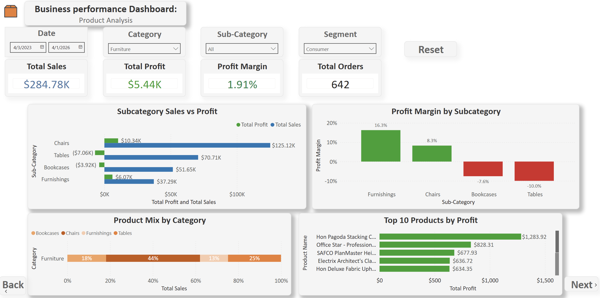

#### Filters Applied
- Date Range = April 3, 2023 — April 1, 2026
- Category = Furniture
- Segment = Consumer

#### KPI Results

| KPI | Value |
|---|---|
| **Total Sales** | $284.78K |
| **Total Profit** | $5.44K |
| **Profit Margin** | 1.91% |
| **Total Orders** | 642 |

#### Business Insight
The Consumer segment within Furniture generated $284.78K in sales but retained only $5.44K in profit — a margin of just 1.91%. This extremely thin margin suggests the Consumer segment is being heavily discounted, absorbing high shipping costs, or being driven by low-margin subcategories.

The subcategory breakdown reveals that **Tables (-10.0%) and Bookcases (-7.6%)** are the primary margin drags within this segment. Chairs and Furnishings remain positive at 16.3% and 8.3% respectively, indicating that the profitability problem is concentrated in specific subcategories rather than the entire Consumer segment.

---

### Scenario 2 — Furniture | Home Office Segment

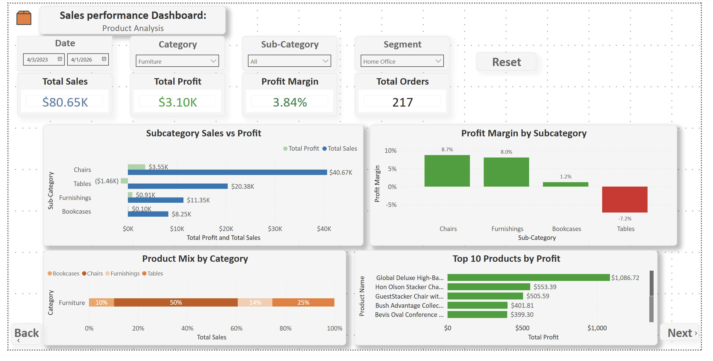

#### Filters Applied
- Date Range = April 3, 2023 — April 1, 2026
- Category = Furniture
- Segment = Home Office

#### KPI Results

| KPI | Value |
|---|---|
| **Total Sales** | $80.65K |
| **Total Profit** | $3.10K |
| **Profit Margin** | 3.84% |
| **Total Orders** | 217 |

#### Business Insight
The Home Office segment within Furniture generated significantly lower revenue ($80.65K) compared to the Consumer segment, but achieved a higher profit margin at 3.84%. This suggests the Home Office segment operates more efficiently despite its smaller scale.

The subcategory breakdown shows **Tables (-7.2%)** remains loss-making in this segment as well, while Chairs (8.7%) and Furnishings (8.0%) perform more strongly here than in the Consumer segment. Bookcases also improved from -7.6% to 1.2% — suggesting the Home Office segment is less price-sensitive or discount-driven than the Consumer segment.

---

### Scenario Comparison — Consumer vs Home Office (Furniture)

| KPI | Consumer Segment | Home Office Segment | Difference |
|---|---|---|---|
| **Total Sales** | $284.78K | $80.65K | Consumer: 3.5× higher volume |
| **Total Profit** | $5.44K | $3.10K | Consumer: higher absolute profit |
| **Profit Margin** | 1.91% | 3.84% | Home Office: ▲ +1.93pp more efficient |
| **Total Orders** | 642 | 217 | Consumer: ~3× more orders |
| **Chairs Margin** | 8.3% | 8.7% | Broadly consistent across segments |
| **Tables Margin** | -10.0% | -7.2% | Home Office: less severe loss |
| **Bookcases Margin** | -7.6% | 1.2% | Home Office: significantly better |

### Combined Business Insight
The comparison reveals that while the Consumer segment generates far greater revenue and order volume, the Home Office segment is meaningfully more profitable on a margin basis. This pattern suggests that Consumer Furniture sales are being driven by higher discounting or a less profitable product mix — particularly in Tables and Bookcases.

The consistent underperformance of **Tables across both segments** confirms this is a structural profitability problem rather than a segment-specific issue. Regardless of who is buying, Tables is losing money.

A strategic recommendation would be to investigate the pricing and discount structure for Tables and Bookcases specifically within the Consumer segment, where the losses are most severe, while protecting the more efficient Home Office margin profile.

### Why This Analysis Matters
This scenario comparison demonstrates the dashboard's ability to:
- isolate segment-level performance,
- identify which customer segments drive margin efficiency vs volume,
- and support targeted pricing and product strategy decisions.

It also validates that all slicers dynamically update every visual across the page simultaneously.

---

# ⚠️ Risk Analysis

## 📋 Dashboard View

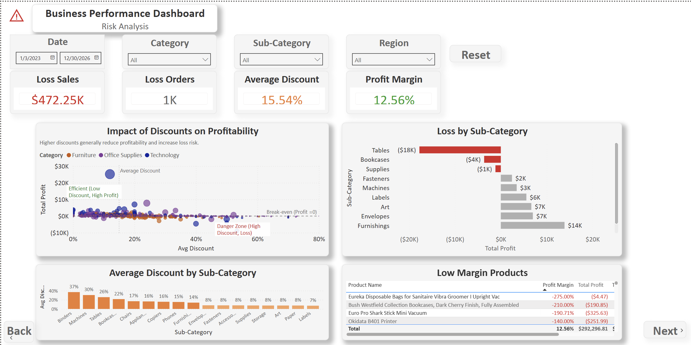

### Overview
While the Executive Overview and Product Analysis pages focus on overall performance and product profitability, the Risk Analysis page investigates the underlying causes of profit loss across the business.

The objective is to identify where the business is losing money, which products and subcategories carry the highest risk, and how discounting behaviour is directly contributing to profit erosion.

This page combines discount impact analysis, subcategory loss identification, discount level tracking, and low margin product investigation to help stakeholders understand and address the root causes of underperformance.

---

## 📌 KPI Summary

| KPI | Value | What It Represents |
|---|---|---|
| **Loss Sales** | $472.25K | Total revenue generated from orders that resulted in a loss |
| **Loss Orders** | 1K | Total number of orders that produced a negative profit outcome |
| **Average Discount** | 15.54% | The average discount applied across all transactions |
| **Profit Margin** | 12.56% | Overall business profit margin across the reporting period |

### Business Insight
The business generated **$472.25K in loss-making sales** across approximately **1,000 orders** — meaning a significant portion of transactions are actively costing the business money rather than contributing to profitability.

With an average discount of **15.54%** sitting just above the average discount reference line, the data suggests that discounting is a primary driver of profit erosion. Understanding where and how discounts are being applied is critical to addressing this risk.

---

## 🚨 Key Risk Findings

The Risk Analysis page revealed three major business risks:

1. **Tables** is the largest loss-making subcategory, generating approximately **-$17.8K** in losses despite strong sales performance.
2. **High discounting is strongly correlated with negative profitability**, with most loss-making transactions occurring above the business average discount level.
3. Several products are operating at extreme negative margins, with discounts ranging from **50%–80%**, indicating weak discount governance and pricing controls.

These findings suggest that profitability challenges are driven more by pricing and discount strategy than by sales volume alone.

---

## 💥 Impact of Discounts on Profitability


### Purpose
This scatter chart maps the relationship between average discount levels and total profit across all transactions, revealing how discounting behaviour directly influences profitability outcomes.

### How to Read This Visual
- Each bubble represents a product or transaction
- Bubble size represents sales volume — larger bubbles indicate higher revenue transactions
- The vertical dashed line marks the **average discount (15.54%)** — a key reference point
- The horizontal dashed line marks the **break-even point (Profit = $0)**
- Two zones are highlighted:
  - 🟢 **Efficient Zone** (Low Discount, High Profit) — transactions generating healthy profit at low discount levels
  - 🔴 **Danger Zone** (High Discount, Loss) — transactions where heavy discounting has pushed profit into negative territory

### Key Findings
The majority of profitable transactions cluster in the **0–20% discount range**, confirming that low-discount sales are the primary driver of business profitability.

As discount levels increase beyond the average, profit levels deteriorate progressively. Transactions in the **40–80% discount range** consistently fall below the break-even line, confirming that heavy discounting is directly causing losses.

The large blue bubble in the Efficient Zone represents the **Canon imageCLASS 2200 Advanced Copier** — generating $25K+ in profit at a low discount level, further reinforcing that high-value Technology products perform best when discounting is minimised.

### Business Insight
The chart tells a clear story: **discounting beyond the business average significantly increases the risk of loss-making transactions.**

The Danger Zone concentration shows that excessive discounting is not just reducing margins — it is actively generating losses. This suggests the business needs a more disciplined discount approval process, particularly for Furniture subcategories and high-volume products where heavy discounting appears most prevalent.

### Why This Visual Was Chosen
A bubble scatter chart is the most effective visual for showing the relationship between two continuous variables (discount level and profit) while incorporating a third dimension (sales volume via bubble size). The quadrant labels and reference lines make the business implications immediately clear without requiring technical interpretation.

---

## 📉 Loss by Sub-Category

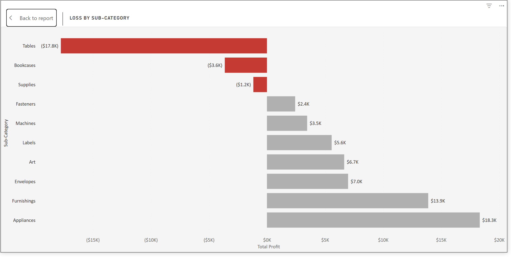

### Purpose
This visual identifies which subcategories are generating losses versus contributing positively to profit, allowing stakeholders to quickly isolate the problem areas within the business.

### Key Findings

#### 🔴 Loss-Making Subcategories

| Subcategory | Total Profit | Risk Level |
|---|---|---|
| **Tables** | -$17.8K | Critical — largest loss in the business |
| **Bookcases** | -$3.6K | High — consistent loss-maker |
| **Supplies** | -$1.2K | Moderate — small but persistent loss |

#### ⚠️ Subcategories Closest to Break-Even

| Subcategory | Total Profit | Observation |
|---|---|---|
| **Fasteners** | $2.4K | Thin margin — vulnerable to discount increases |
| **Machines** | $3.5K | Low profit relative to high sales volume |

### Business Insight
**Tables is the single most damaging subcategory in the business**, generating a loss of $17.8K despite $208K in sales. Every Tables transaction is, on average, costing the business money.

The combined loss from Tables, Bookcases, and Supplies totals approximately **$22.6K** — a figure that directly suppresses the overall business profit margin. Addressing profitability in these three subcategories alone would meaningfully improve overall business performance.

At the other end, Appliances ($18.3K) and Furnishings ($13.9K) demonstrate that Furniture subcategories *can* be profitable — confirming that the loss problem is concentrated in specific subcategories rather than being a category-wide issue.

### Why This Visual Was Chosen
A diverging bar chart with conditional colour coding (red for losses, grey for profits) makes the contrast between loss-making and profitable subcategories immediately visible. The $0K centre line serves as the natural break-even reference point.

---

## 📊 Average Discount by Sub-Category

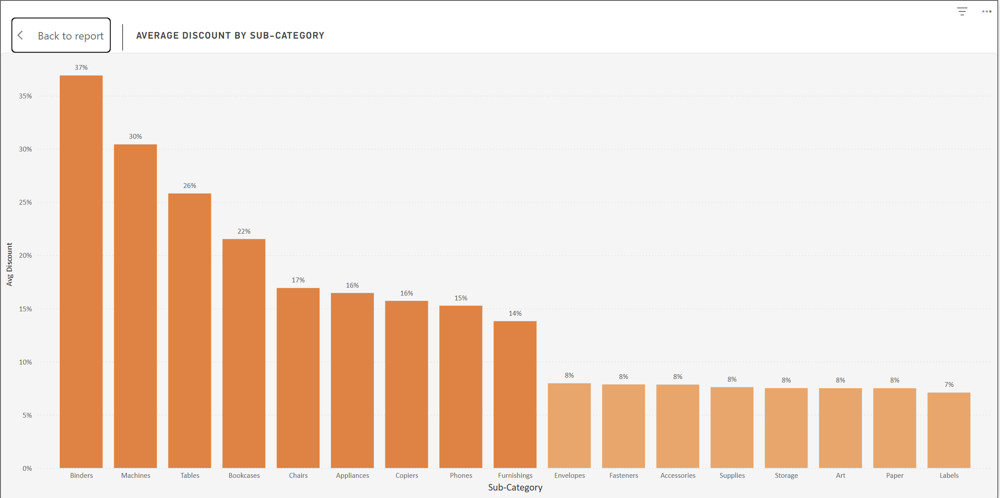

### Purpose
This visual ranks all subcategories by their average discount level, identifying which subcategories are being discounted most heavily and connecting discount behaviour to the loss patterns identified in the previous visuals.

### Key Findings

| Subcategory | Avg Discount | Profit Status | Connection |
|---|---|---|---|
| **Binders** | 37% | Marginal profit | Highest discounted subcategory |
| **Machines** | 30% | Low profit ($3.5K) | Heavy discounting suppressing margins |
| **Tables** | 26% | -$17.8K loss | High discount driving largest business loss |
| **Bookcases** | 22% | -$3.6K loss | Above-average discount contributing to loss |
| **Chairs** | 17% | Positive profit | Discount manageable but above average |
| **Labels** | 7% | 43.9% margin | Lowest discount — highest margin |

### Business Insight
The discount ranking directly explains the loss patterns seen in the previous visual. **Tables (26%) and Bookcases (22%) are both being discounted significantly above the business average of 15.54%** — and both are loss-making subcategories.

The inverse relationship is equally revealing: subcategories with the lowest discounts — Labels (7%), Paper (8%), Envelopes (8%) — consistently achieve the highest profit margins in the business. This pattern confirms that **discount discipline is the single most controllable lever for improving business profitability.**

Binders, with the highest average discount at 37%, has not yet tipped into loss — but is operating at a level that makes it highly vulnerable to becoming loss-making if discount levels increase further.

### Why This Visual Was Chosen
A ranked column chart ordered from highest to lowest discount makes it easy to identify which subcategories carry the greatest discounting risk. The ranking format enables direct comparison across all subcategories in a single view.

---

## 🔍 Low Margin Products

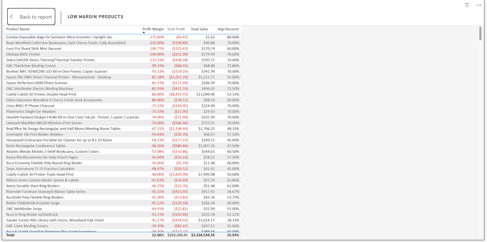

### Purpose
This table identifies individual products with the most severely negative profit margins, providing granular visibility into specific products that are driving the business losses identified at the subcategory level.

### Key Findings

| Product | Profit Margin | Total Profit | Avg Discount |
|---|---|---|---|
| Eureka Disposable Bags for Sanitaire Vibra Groomer | -275.00% | -$4.47 | 80.00% |
| Bush Westfield Collection Bookcases | -210.00% | -$190.85 | 70.00% |
| Euro Pro Shark Stick Mini Vacuum | -190.71% | -$325.63 | 60.00% |
| Okidata B401 Printer | -140.00% | -$251.99 | 70.00% |
| Cubify CubeX 3D Printer Double Head Print | -80.00% | -$8,879.97 | 53.33% |

### Business Insight
The Low Margin Products table reveals that **extreme discounting is the common thread across nearly every loss-making product**. Products with margins of -80% to -275% are almost universally carrying discounts of 50–80% — far beyond what any margin can sustainably absorb.

The **Cubify CubeX 3D Printer** stands out as the highest absolute loss product, generating -$8,879.97 in losses despite $11,099.96 in sales. This is a critical finding — a product generating over $11K in revenue is simultaneously destroying nearly $9K in profit value, representing a significant net drain on business performance.

The table also confirms a broader pattern: **no product operating at a 50%+ discount is generating positive profit**. This provides a clear, data-backed threshold for discount policy reform.

### Why This Visual Was Chosen
A sortable table is the most appropriate visual for product-level detail because it allows stakeholders to sort by margin, profit, or discount to investigate specific products and identify patterns across the loss-making portfolio.

---

## 🎛️ Interactive Slicers & Filtering

The Risk Analysis page includes interactive slicers for:
- **Date filtering** — analyse risk patterns across custom time periods
- **Category** — isolate discount and loss behaviour within specific categories
- **Sub-Category** — drill into specific subcategory risk profiles
- **Region** — identify whether loss and discount patterns vary by geography

These slicers allow stakeholders to dynamically investigate risk at any level of the business — from the overall portfolio down to a specific subcategory in a specific region.

---

## 📌 Scenario-Based Analysis

The following scenarios demonstrate how the Risk Analysis page responds to targeted filtering, revealing how discount-driven losses manifest differently across specific segments of the business.

---

### Scenario 1 — Technology | East Region

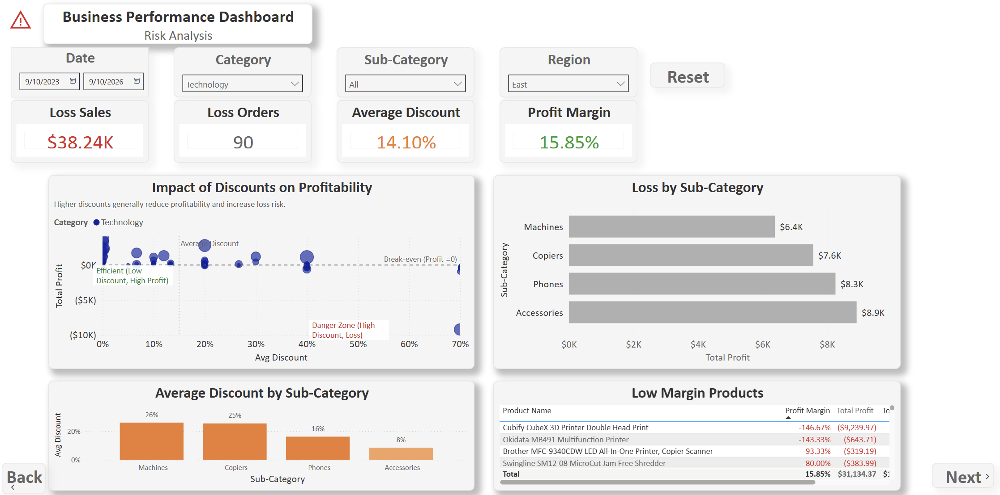

#### Filters Applied
- Date Range = September 10, 2023 — September 10, 2026
- Category = Technology
- Region = East

#### KPI Results

| KPI | Value |
|---|---|
| **Loss Sales** | $38.24K |
| **Loss Orders** | 90 |
| **Average Discount** | 14.10% |
| **Profit Margin** | 15.85% |

#### Business Insight
The Technology category within the East region delivers a **profit margin of 15.85%** — above the overall business average of 12.56%. With only 90 loss-making orders and an average discount of 14.10% (below the business average), this segment demonstrates relatively disciplined discounting behaviour.

The Loss by Sub-Category breakdown shows that within this filtered segment, **Accessories ($8.9K), Phones ($8.3K), and Copiers ($7.6K)** are the most profitable subcategories, while **Machines** carries the highest discount level at 26% — consistent with the broader business pattern of Machines being heavily discounted.

The Low Margin Products table reveals that loss-making products in this segment are primarily driven by **Cubify CubeX 3D Printers and Okidata printers**, both carrying discounts of 53–70%.

---

### Scenario 2 — Furniture | Tables | East Region

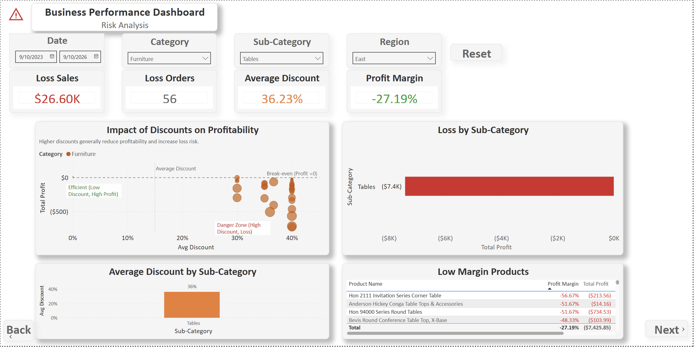

#### Filters Applied
- Date Range = September 10, 2023 — September 10, 2026
- Category = Furniture
- Sub-Category = Tables
- Region = East

#### KPI Results

| KPI | Value |
|---|---|
| **Loss Sales** | $26.60K |
| **Loss Orders** | 56 |
| **Average Discount** | 36.23% |
| **Profit Margin** | -27.19% |

#### Business Insight
This scenario isolates the single most damaging combination in the business — **Tables in the East region** — and the results are stark. A profit margin of **-27.19%** means the business is losing $0.27 for every dollar of Tables revenue generated in this region.

With an average discount of **36.23%** — more than double the business average of 15.54% — the scatter chart shows all transactions clustering in the Danger Zone, confirming that discounting at this level makes profitable Tables sales virtually impossible.

The Low Margin Products table identifies specific table products driving the deepest losses, including the **Hon 2111 Invitation Series Corner Table (-56.67%)** and **Hon 94000 Series Round Tables (-51.67%)** — both operating at significant losses across 56 loss-making orders.

---

### Scenario Comparison — Technology East vs Furniture Tables East

| KPI | Technology — East | Furniture Tables — East | Difference |
|---|---|---|---|
| **Loss Sales** | $38.24K | $26.60K | Technology: higher absolute loss volume |
| **Loss Orders** | 90 | 56 | Technology: more loss-making transactions |
| **Average Discount** | 14.10% | 36.23% | Tables: 2.5× higher discount level |
| **Profit Margin** | 15.85% | -27.19% | Tables: 43pp worse margin performance |

### Combined Business Insight
The comparison exposes a fundamental difference in how risk manifests across these two segments.

**Technology East** generates more loss-making orders in absolute terms, but maintains a healthy overall margin of 15.85% — meaning profitable transactions significantly outweigh the loss-making ones. The risk here is manageable and concentrated in specific heavily-discounted products.

**Furniture Tables East**, by contrast, has a systemic profitability problem. A -27.19% margin with a 36.23% average discount means there is no healthy baseline of profitable transactions offsetting the losses — the entire segment is structurally unprofitable under current discounting conditions.

This comparison demonstrates that **not all loss-making segments carry equal risk**. Technology losses are product-specific and addressable through targeted discount controls. Furniture Tables losses are structural and require a fundamental review of pricing strategy, discount policy, and potentially whether the product line is viable at current cost levels.

### Why This Analysis Matters
This scenario analysis demonstrates the dashboard's ability to:
- isolate risk at the intersection of category, subcategory, and region,
- distinguish between manageable product-level risk and structural segment risk,
- and provide the granular evidence stakeholders need to take targeted corrective action.

---

# 🚀 Business Drivers Analysis

## 📋 Dashboard View

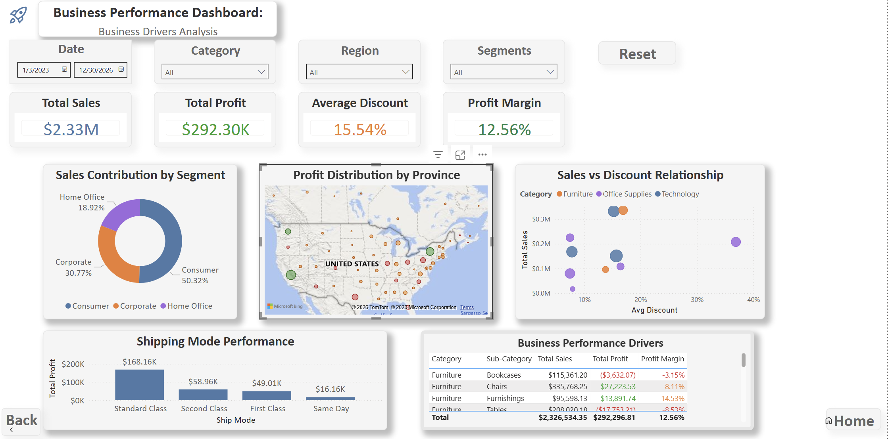

### Overview
While the Executive Overview monitors overall business health, the Product Analysis examines product-level profitability, and the Risk Analysis investigates loss drivers, the Business Drivers Analysis page answers a different question entirely:

> *What is actually driving business performance — and where are the strongest growth opportunities?*

This page combines customer segment contribution analysis, geographic profit distribution, discount-to-sales relationships, shipping mode performance, and subcategory-level business drivers to give stakeholders a complete picture of the forces shaping business results.

---

## 📌 KPI Summary

| KPI | Value | What It Represents |
|---|---|---|
| **Total Sales** | $2.33M | Total revenue generated across all products, categories, and regions |
| **Total Profit** | $292.30K | Actual profit retained after operational and product-related costs |
| **Average Discount** | 15.54% | The average discount applied across all transactions |
| **Profit Margin** | 12.56% | Overall business profit margin across the reporting period |

### Business Insight
These KPIs provide the overall business benchmark used to evaluate how customer segments, regions, shipping modes, and product groups contribute to business performance.

---

## 🧩 Sales Contribution by Segment

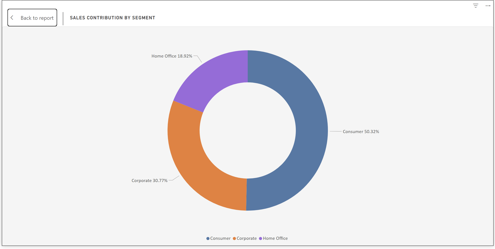

### Purpose
This visual shows how total sales are distributed across the three customer segments — Consumer, Corporate, and Home Office — identifying which segments drive the most revenue and where growth opportunities may exist.

### Key Findings

| Segment | Sales Contribution |
|---|---|
| **Consumer** | 50.32% |
| **Corporate** | 30.77% |
| **Home Office** | 18.92% |

### Business Insight
The **Consumer segment drives over half of total business revenue** at 50.32%, making it the single most important customer group by sales volume. However, volume alone does not indicate profitability — the Risk Analysis and scenario comparisons on this page reveal that Consumer Furniture sales in particular carry extremely thin margins.

The **Corporate segment at 30.77%** represents a significant and potentially more profitable customer base. Corporate buyers typically purchase in higher volumes with less price sensitivity than individual consumers, making this segment worth prioritising for growth.

**Home Office at 18.92%** is the smallest segment but consistently demonstrates stronger margin efficiency in scenario analysis — suggesting it may be underserved relative to its profitability potential.

### Why This Visual Was Chosen
A donut chart is ideal for showing proportional contribution across a small number of categories. The clean three-segment split makes percentage comparisons immediately visible without requiring detailed analysis.

---

## 🗺️ Profit Distribution by Province

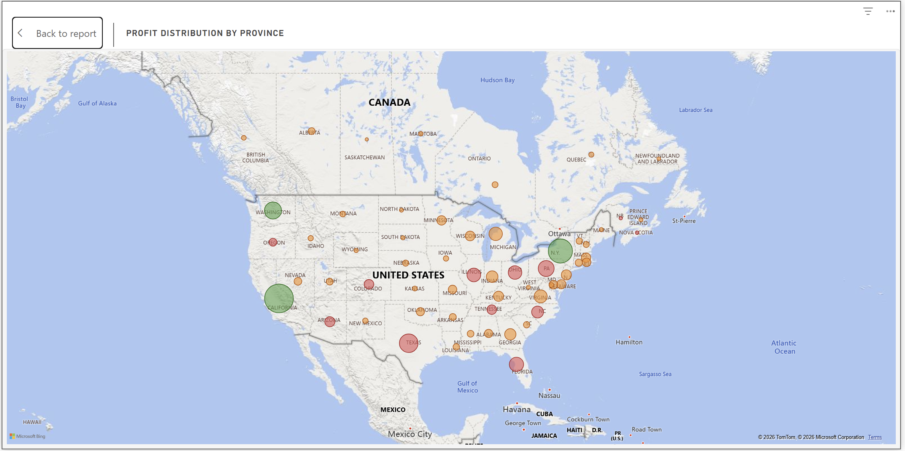

### Purpose
This bubble map visualises profit performance at the state level, replacing a simple regional bar chart to reveal *where within each region* profit is actually being generated — and where geographic risk concentrations exist.

### How to Read This Visual
- **Bubble size** represents sales volume — larger bubbles indicate higher revenue states
- **Colour gradient** represents profit performance:
  - 🟢 **Dark green** — high profit states
  - 🟠 **Orange** — moderate profit states
  - 🔴 **Pink/Red** — low profit or loss-contributing states

### Key Findings

| State | Profit Signal | Observation |
|---|---|---|
| **California** | 🟢 Dark green, large bubble | Dominant profit driver — strongest state in the business |
| **Washington** | 🟢 Green, medium bubble | Second strongest West Coast contributor |
| **New York** | 🟢 Green, medium bubble | Primary East region profit anchor |
| **Texas** | 🔴 Large pink bubble | High sales volume but low profit contribution |
| **Florida** | 🔴 Pink bubble | Below-average profit performance despite market size |
| **Northeast cluster** | 🟠 Orange bubbles | Moderate performance across Pennsylvania, Ohio, Illinois |

### Business Insight
The map reveals that **West Coast and Northeast states are the primary profit engines of the business**. California alone appears to be the single largest profit-contributing state, with Washington reinforcing the West region's dominance.

The most striking finding is the **Texas and Florida anomaly** — both are large states with significant sales bubbles, yet their pink/red colouring signals that profit performance is well below their revenue potential. This mirrors the broader pattern identified in the Risk Analysis: high-discount, low-margin transactions are concentrated in specific geographic areas rather than being evenly distributed.

The Central region's predominantly orange colouring confirms it as the weakest-performing region — consistent with the overall findings showing Central generating only $40K in profit compared to West's $111K.

### Why This Visual Was Chosen
A bubble map communicates geographic profit distribution far more effectively than a regional bar chart. It reveals *which specific states* drive performance within each region — turning four regional numbers into a geographically actionable insight that stakeholders can use to target investment and sales strategy.

---

## 💠 Sales vs Discount Relationship

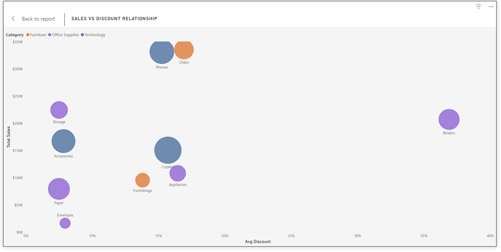

### Purpose
This scatter chart maps total sales against average discount level by subcategory, identifying which subcategories generate the highest revenue relative to their discount levels — and which ones rely on heavy discounting to drive volume.

### Key Findings

| Subcategory | Total Sales | Avg Discount | Observation |
|---|---|---|---|
| **Phones** | ~$330K | ~15% | Highest sales at moderate discount — strong driver |
| **Chairs** | ~$335K | ~15% | High sales at moderate discount — volume driver |
| **Storage** | ~$225K | ~7% | Strong sales at very low discount — highly efficient |
| **Accessories** | ~$167K | ~7% | Good sales at low discount — efficient performer |
| **Binders** | ~$207K | ~38% | High sales but extremely high discount — risky |
| **Copiers** | ~$150K | ~15% | Moderate sales at average discount — profitable |

### Business Insight
**Storage and Accessories stand out as the most efficient subcategories** — generating strong sales at very low discount levels (7–8%). These subcategories are driving revenue without relying on price reductions, making them the most sustainable sales contributors in the business.

**Binders is the most concerning data point on this chart** — sitting far to the right at ~38% average discount with $207K in sales. This means a significant revenue stream is being generated almost entirely through heavy discounting. Combined with the Risk Analysis finding that Binders has not yet tipped into loss, this subcategory represents a high-risk growth dependency that warrants close monitoring.

**Phones and Chairs** generate the highest revenue at moderate discount levels — confirming their importance as core business volume drivers without excessive price concessions.

### Why This Visual Was Chosen
A bubble scatter chart effectively shows the relationship between sales volume and discount behaviour simultaneously, allowing stakeholders to identify both high-performing and at-risk subcategories in a single view.

---

## 🚚 Shipping Mode Performance

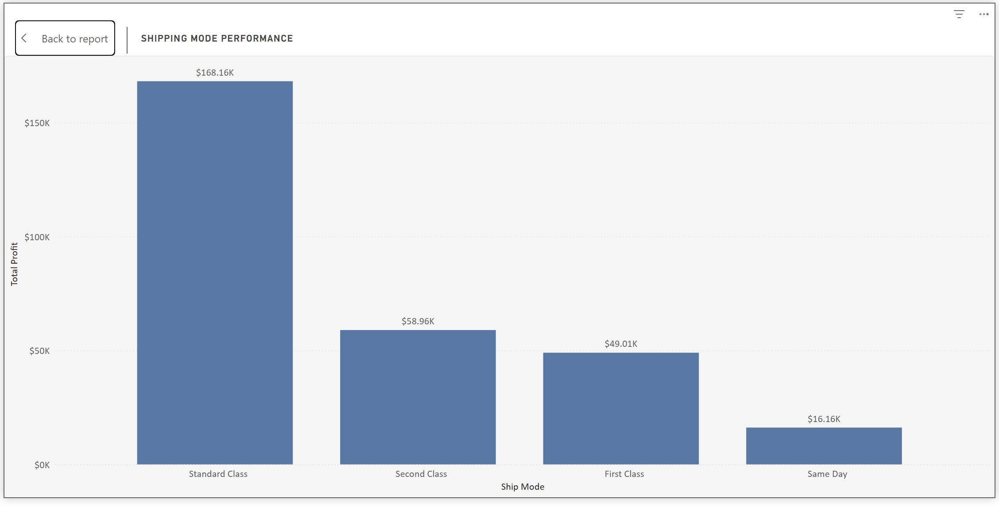

### Purpose
This visual analyses profit contribution by shipping mode, identifying which delivery methods generate the most business value and where operational efficiency may be improved.

### Key Findings

| Ship Mode | Total Profit | Observation |
|---|---|---|
| **Standard Class** | $168.16K | Dominant profit contributor — 57% of total profit |
| **Second Class** | $58.96K | Strong secondary contributor |
| **First Class** | $49.01K | Solid performance — similar to Second Class |
| **Same Day** | $16.16K | Lowest profit contribution |

### Business Insight
**Standard Class shipping generates $168.16K in profit — more than the other three shipping modes combined.** This is a significant operational finding: the lowest-cost shipping option is simultaneously the highest profit contributor, suggesting that customers ordering via Standard Class are either less price-sensitive, ordering higher-margin products, or both.

**Same Day delivery at $16.16K** raises an important question — given the higher operational cost of expedited shipping, is the profit margin on Same Day orders significantly lower than Standard Class? If so, the business may be subsidising fast shipping without adequate pricing to compensate.

This finding suggests an opportunity to review the pricing structure for premium shipping modes to ensure faster delivery options are not eroding margins.

### Why This Visual Was Chosen
A column chart ranked by profit makes shipping mode performance immediately comparable. The descending order clearly communicates the profit hierarchy without requiring interpretation.

---

## 📋 Business Performance Drivers

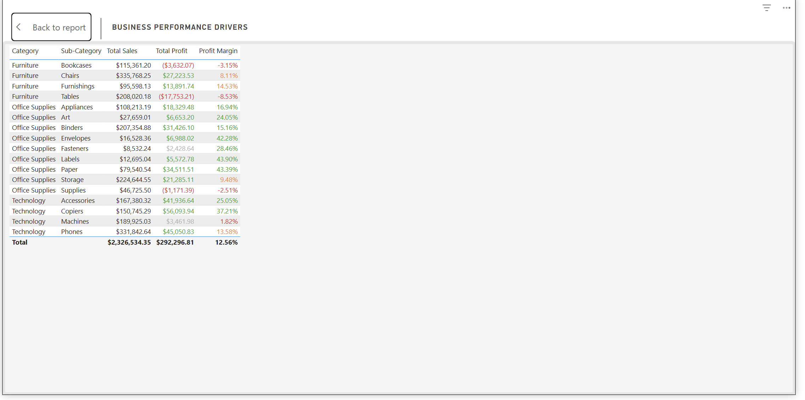

### Purpose
This table provides a complete subcategory-level breakdown of sales, profit, and margin across all three categories — serving as the single most comprehensive reference point for understanding exactly which subcategories are driving business performance.

### Key Findings

#### 🟢 Highest Margin Subcategories

| Category | Subcategory | Total Sales | Total Profit | Profit Margin |
|---|---|---|---|---|
| Office Supplies | Labels | $12,695.04 | $5,572.78 | 43.90% |
| Office Supplies | Paper | $79,540.54 | $34,511.51 | 43.39% |
| Office Supplies | Envelopes | $16,528.36 | $6,988.02 | 42.28% |
| Technology | Copiers | $150,745.29 | $56,093.94 | 37.21% |
| Technology | Accessories | $167,380.32 | $41,936.64 | 25.05% |

#### 🔴 Loss-Making Subcategories

| Category | Subcategory | Total Sales | Total Profit | Profit Margin |
|---|---|---|---|---|
| Furniture | Tables | $208,020.18 | -$17,753.21 | -8.53% |
| Furniture | Bookcases | $115,361.20 | -$3,632.07 | -3.15% |
| Office Supplies | Supplies | $46,725.50 | -$1,171.39 | -2.51% |

### Business Insight
The Business Performance Drivers table consolidates every finding from the previous pages into a single comprehensive view. The data confirms the core narrative of the entire dashboard:

**The business has a two-speed profitability structure.** A group of Office Supplies subcategories (Labels, Paper, Envelopes) and Technology subcategories (Copiers, Accessories) are operating at margins of 25–44%, quietly generating the profit that sustains overall business health. Meanwhile, Furniture subcategories — particularly Tables and Bookcases — are generating significant revenue while actively destroying value.

**Technology Copiers at 37.21% margin on $150K in sales** is arguably the single most valuable subcategory in the business relative to its size. It combines strong absolute profit ($56K) with exceptional margin efficiency.

**Machines at 1.82%** is the most vulnerable healthy subcategory — generating minimal profit on $189K in sales. Any increase in costs, discounts, or fulfilment expenses could push it into loss territory.

### Why This Visual Was Chosen
A sortable table is the most appropriate format for comprehensive subcategory-level data because it allows stakeholders to rank, compare, and investigate individual performance drivers across the entire product portfolio in a single view.

---

## 🎛️ Interactive Slicers & Filtering

The Business Drivers Analysis page includes interactive slicers for:
- **Date filtering** — analyse driver performance across custom time periods
- **Category** — isolate performance drivers within specific categories
- **Region** — compare how business drivers vary across geographic markets
- **Segments** — evaluate how Consumer, Corporate, and Home Office segments differ in performance

These slicers allow stakeholders to dynamically explore which combinations of category, region, and segment produce the strongest business outcomes.

---

## 📌 Scenario-Based Analysis

The following two scenarios compare Technology performance across two different region and segment combinations, demonstrating how the same category can produce meaningfully different outcomes depending on geographic and customer context.

---

### Scenario 1 — Technology | East Region | Consumer Segment

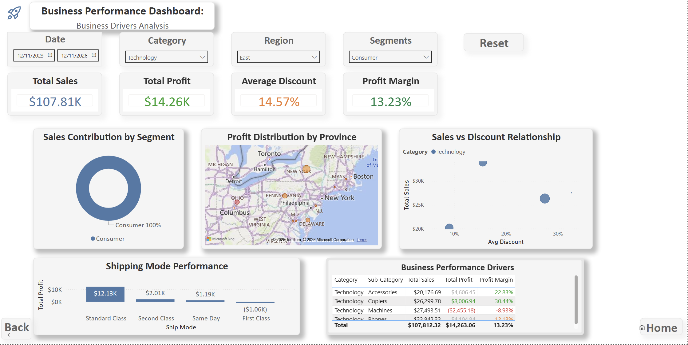

#### Filters Applied
- Date Range = December 11, 2023 — December 11, 2026
- Category = Technology
- Region = East
- Segment = Consumer

#### KPI Results

| KPI | Value |
|---|---|
| **Total Sales** | $107.81K |
| **Total Profit** | $14.26K |
| **Average Discount** | 14.57% |
| **Profit Margin** | 13.23% |

#### Business Insight
Technology sales to Consumer customers in the East region generate a **13.23% profit margin** — slightly above the overall business average of 12.56%. The average discount of 14.57% sits just below the business average, suggesting Consumer Technology buyers in the East are moderately price-sensitive but not heavily discounted.

The map zooms into the Northeast corridor, showing profit concentration around **New York and Massachusetts** — confirming these as the primary Consumer Technology markets in the East region.

The Business Performance Drivers table shows **Copiers (30.44% margin) and Accessories (22.83%)** as the strongest performing subcategories, while **Machines at -8.93%** is the primary drag — consistent with the broader business pattern of Machines underperforming due to heavy discounting.

Standard Class shipping dominates profit contribution at $12.13K, with First Class generating a loss of -$1.06K — suggesting premium shipping in this segment is not adequately priced to cover its costs.

---

### Scenario 2 — Technology | West Region | Corporate Segment

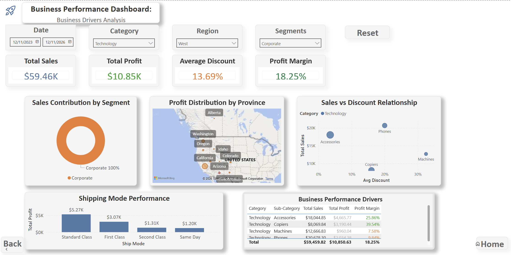

#### Filters Applied
- Date Range = December 11, 2023 — December 11, 2026
- Category = Technology
- Region = West
- Segment = Corporate

#### KPI Results

| KPI | Value |
|---|---|
| **Total Sales** | $59.46K |
| **Total Profit** | $10.85K |
| **Average Discount** | 13.69% |
| **Profit Margin** | 18.25% |

#### Business Insight
Technology sales to Corporate customers in the West region generate an **18.25% profit margin** — significantly above both the overall business average (12.56%) and the East Consumer scenario (13.23%). Despite generating lower absolute revenue ($59.46K vs $107.81K), this segment is considerably more profitable on a per-dollar basis.

The map zooms into the West Coast, confirming **California and Washington** as the dominant profit states within this filtered segment — reinforcing the earlier finding that these two states are the strongest geographic profit drivers in the entire business.

The Business Performance Drivers table shows **Copiers at 39.54% margin** as the standout performer, with Accessories at 25.86% confirming Technology's strength in the West Corporate segment. Machines at 7.58% is notably better here than in the East Consumer scenario (-8.93%), suggesting Corporate buyers in the West are less discount-dependent for Technology purchases.

The lower average discount of **13.69%** — below both the business average and the East Consumer scenario — is the key explanation for the stronger margin. Corporate customers in the West appear to be the least price-sensitive Technology buyers in the business.

---

### Scenario Comparison — Technology East Consumer vs Technology West Corporate

| KPI | East — Consumer | West — Corporate | Difference |
|---|---|---|---|
| **Total Sales** | $107.81K | $59.46K | East: 1.8× higher volume |
| **Total Profit** | $14.26K | $10.85K | East: higher absolute profit |
| **Average Discount** | 14.57% | 13.69% | West Corporate: lower discount |
| **Profit Margin** | 13.23% | 18.25% | West Corporate: ▲ +5.02pp more efficient |
| **Copiers Margin** | 30.44% | 39.54% | West Corporate: significantly stronger |
| **Machines Margin** | -8.93% | 7.58% | West Corporate: dramatic improvement |
| **Top Profit State** | New York | California | Different geographic anchors |

### Combined Business Insight
This comparison reveals one of the most actionable insights in the entire dashboard: **the Corporate segment in the West region is significantly more profitable than the Consumer segment in the East for Technology products** — despite generating less than half the revenue.

The margin difference of 5.02 percentage points is driven by three factors working together: lower average discounts, a stronger Copiers performance, and dramatically better Machines profitability. Corporate buyers in the West appear to purchase Technology products with less price negotiation, generating cleaner margins across the subcategory mix.

The strategic implication is clear: **growing Technology sales to Corporate customers in the West region — particularly in California — represents one of the highest-value growth opportunities in the business.** This segment combines the business's most profitable geography with its most margin-efficient customer type.

### Why This Analysis Matters
This scenario comparison demonstrates the dashboard's ability to:
- identify which combinations of category, region, and segment produce optimal business outcomes,
- explain *why* margin differences exist through subcategory and discount-level drill-down,
- and surface specific, data-backed growth opportunities for strategic decision-making.

---

# 🎯 Strategic Recommendations

Based on the findings across all dashboard pages, the following actions are recommended:

## 1. Strengthen Discount Governance
Tables, Bookcases, and several low-margin products consistently operate at a loss while carrying above-average discount levels. Introducing discount approval thresholds and reviewing promotional policies could reduce unnecessary profit erosion.

## 2. Reassess Furniture Pricing Strategy
Tables generated over $208K in sales but produced a loss of $17.8K. A review of pricing structures, supplier costs, fulfilment expenses, and discount practices is recommended to determine whether profitability can be restored.

## 3. Expand High-Margin Product Segments
Copiers, Accessories, Labels, Paper, and Envelopes consistently demonstrate strong margin performance and should be prioritised for growth initiatives and marketing investment.

## 4. Increase Focus on High-Profit Customer Segments
Technology sales to Corporate customers in the West region generated an 18.25% profit margin, making this one of the most attractive growth opportunities identified in the analysis.

## 5. Establish Ongoing Profitability Monitoring
Regular monitoring of Profit Margin, Average Discount, Loss Orders, Loss Sales, and low-margin products would enable earlier detection of emerging profitability risks and support more proactive decision-making.

---

# 📝 Conclusion

This Business Performance Dashboard demonstrates that revenue growth alone is not a reliable indicator of business health. Across $2.33M in sales, the analysis revealed a business with genuine strengths — a high-performing Technology category, efficient Office Supplies subcategories, and a profitable West Coast market — operating alongside structural weaknesses driven by discounting behaviour and product mix decisions.

The core finding is consistent across every page of the dashboard: **discount discipline is the single most controllable lever available to improve profitability.** The data shows clearly that subcategories and products operating above the average discount threshold consistently produce lower margins or outright losses, while those with disciplined pricing generate the highest returns.

The dashboard was designed not just to report what happened, but to help stakeholders understand *why* it happened and *what to do about it*. Through interactive filtering, scenario-based analysis, and cross-page insight connections, it provides the analytical foundation needed to make more informed, data-driven decisions across pricing, product strategy, customer segmentation, and regional investment.

The most actionable opportunity identified is the expansion of Technology sales to Corporate customers in the West region — a segment that combines the business's strongest geography with its most margin-efficient customer type, and one that the dashboard can continue to monitor and evaluate as strategy evolves.

---

# 📐 Key DAX Measures

The following DAX measures were written to calculate business KPIs and support dynamic analysis across all dashboard pages.

```dax
Total Sales =
SUM(Orders[Sales])

Total Profit =
SUM(Orders[Profit])

Profit Margin =
DIVIDE([Total Profit], [Total Sales])

Loss Sales =
CALCULATE(
    [Total Sales],
    FILTER(Orders, Orders[Profit] < 0)
)

Average Discount =
AVERAGE(Orders[Discount])
```

---

## 🚀 Skills Demonstrated

- Data Cleaning & Transformation
- DAX Calculations
- KPI Reporting
- Subcategory & Product-Level Analysis
- Profit Margin Analysis
- Risk Identification & Assessment
- Business Driver Analysis
- Geographic Profit Analysis
- Customer Segment Analysis
- Shipping Mode Performance Analysis
- Interactive Dashboard Design
- Map Visualisation
- Business Performance Analysis
- Data Storytelling
- Scenario-Based Analysis
- Executive Reporting
- Strategic Insight Communication

---

## 🛠️ Tools Used

- Power BI
- Power Query
- DAX

---

> *"The goal is not to have more data. The goal is to have better decisions."*
